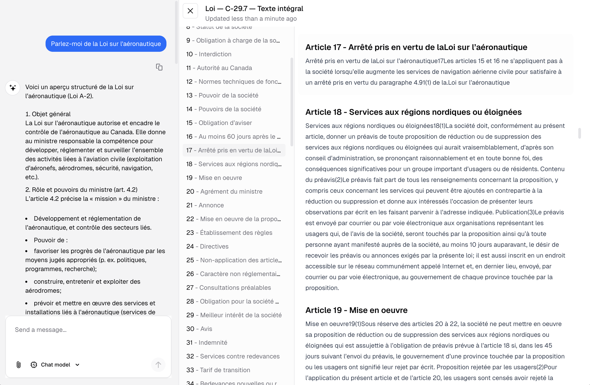

# 🇨🇦 Federal Parliament & Legislation Workbench

A bilingual AI/RAG application for querying and understanding Canadian Federal
Parliament and Legislation data.

## Open Data Sources

### Parliament

[Open Parliament](https://openparliament.ca/data-download/)

### Legislation

[Justice Canada](https://github.com/justicecanada/laws-lois-xml)

## Documentation

[Documentation](./docs/README.md)

## Licences & Notices

- [LICENSE](./LICENSE.md)
- [NOTICES](./NOTICES.md)

## Contributing

- [CONTRIBUTING](./CONTRIBUTING.md)

## About

_A [Shawn Price](https://shawnprice.com) 🤝
[Build Canada](https://buildcanada.com) joint_
